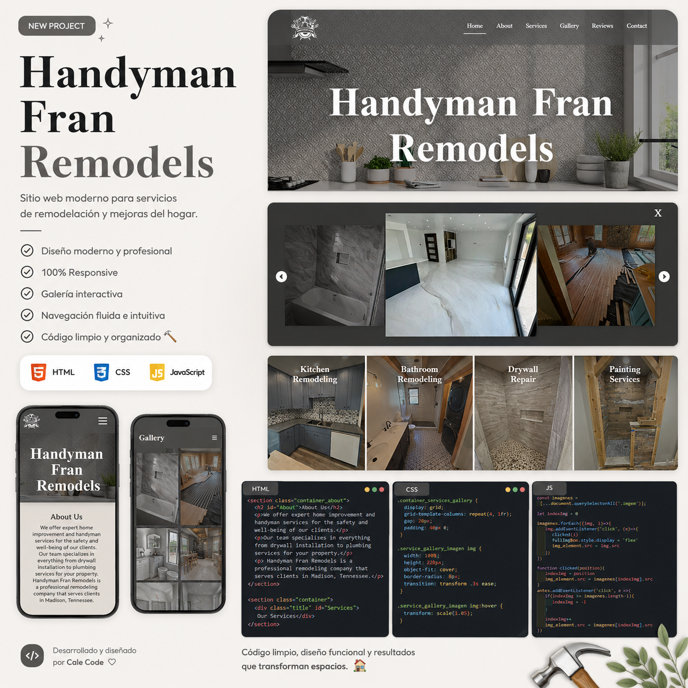

# Handyman Fran Remodels

## Descripción

Sitio web corporativo desarrollado para **Handyman Fran Remodels**, una empresa dedicada a servicios de remodelación y mantenimiento del hogar.

Este fue mi **primer proyecto para un cliente real**, donde me encargué del desarrollo del sitio web utilizando tecnologías web nativas, con el objetivo de ofrecer una presencia profesional en internet y facilitar el contacto con nuevos clientes.

## Características

* Diseño responsive para dispositivos móviles, tablets y computadoras.
* Página de inicio con presentación de la empresa.
* Sección **About Us** con información del negocio.
* Catálogo de servicios.
* Galería de trabajos realizados.
* Formulario para dejar reseñas.
* Formulario de contacto.
* Menú de navegación adaptable.
* Galería interactiva desarrollada con JavaScript.

## Tecnologías utilizadas

* HTML5
* CSS3
* JavaScript

## Demo

🔗 GitHub Pages: https://michellcode03.github.io/Handyman-Fran-Remodels-Website/

## Lo que aprendí

Este proyecto representó un antes y un después en mi proceso como desarrollador, ya que fue el **primer sitio web que desarrollé para un cliente real**.

Durante su desarrollo aprendí a:

* Comprender los requerimientos de un cliente.
* Organizar un proyecto web con múltiples secciones.
* Crear interfaces adaptables para diferentes dispositivos.
* Implementar funcionalidades interactivas utilizando JavaScript.
* Entregar un proyecto pensado para representar profesionalmente un negocio.

## Mejoras futuras

* Integrar un backend para que los formularios envíen información.
* Optimizar el SEO y el rendimiento.
* Mejorar la accesibilidad.
* Agregar un panel para administrar el contenido del sitio.

## Vista previa

## Autor

Desarrollado por **Michell Code**.

